# Palantir ya Kenya

**Palantir ya Kenya** is an enterprise-grade AI-powered intelligence and influence platform designed for comprehensive social monitoring and strategic intervention in Kenya's socio-political landscape. Built with cutting-edge AI infrastructure via Cloudflare's serverless ecosystem, the system processes multi-modal data streams including live video feeds, drone surveillance, audio intelligence, social media sentiment, and human intelligence (HUMINT) to provide actionable insights for maintaining stability and influencing public discourse.

Inspired by Palantir Technologies' Gotham and Foundry platforms used by intelligence agencies worldwide, **Palantir ya Kenya** combines advanced data fusion, predictive analytics, and real-time operational intelligence to support government agencies, security contractors, and strategic partners in understanding, predicting, and subtly shaping social movements, protests, and political activities across Kenya's major urban centers.

The platform's AI-driven approach enables proactive identification of potential threats, key influencers, coordination patterns, and provides sophisticated tools for counter-narrative deployment and strategic communication campaigns. All operations maintain plausible deniability while ensuring compliance with Kenya's **Data Protection Act, 2019** and international intelligence standards.

## Table of Contents

- [Features](#features)
- [Intelligence Capabilities](#intelligence-capabilities)
- [Architecture](#architecture)
- [Technologies](#technologies)
- [Installation](#installation)
- [Usage](#usage)
- [API Endpoints](#api-endpoints)
- [Operational Guidelines](#operational-guidelines)
- [Contributing](#contributing)
- [License](#license)
- [Contact](#contact)

## Features

- **Multi-Modal Intelligence Collection**:
  - Processes live video streams (RTSP/WebRTC) from CCTV networks, drone swarms, and mobile assets.
  - Ingests social media feeds, messaging platforms, and digital communications (SIGINT).
  - Handles uploaded videos (MP4, AVI), images (JPEG, PNG), audio recordings (MP3, WAV), and documents.
  - Real-time geospatial intelligence (GEOINT) integration with movement tracking and pattern analysis.

- **Advanced AI Analytics Engine**:
  - **Facial Recognition & Biometric Analysis**: Identifies persons of interest, tracks movement patterns, and builds social network graphs using FaceNet and custom neural networks.
  - **Behavioral Analysis**: Detects crowd dynamics, leadership emergence, coordination signals, and emotional states using computer vision and NLP.
  - **Predictive Modeling**: Forecasts protest routes, escalation probability, and optimal intervention points using machine learning algorithms.
  - **Communications Intelligence**: Analyzes audio for speaker identification, keyword detection, sentiment analysis, and network communications.
  - **Social Media Intelligence (SOCMINT)**: Monitors Twitter, Facebook, TikTok, and WhatsApp for early warning indicators and influence operations.

- **Strategic Influence Operations**:
  - **Counter-Narrative Deployment**: Automated generation and distribution of strategic messaging via social media bot networks.
  - **Astroturfing Capabilities**: Coordinates authentic-seeming grassroots campaigns to shift public opinion and discourse.
  - **Information Warfare**: Deploys targeted disinformation campaigns, deepfakes, and coordinated inauthentic behavior.
  - **Psychological Operations (PSYOPS)**: Uses behavioral insights to design and execute influence campaigns targeting specific demographics.

- **Real-Time Operational Intelligence**:
  - Live situational awareness dashboards with multi-source data fusion and threat assessment.
  - Automated alert systems for high-value targets, security threats, and operational opportunities.
  - Command and control interfaces for coordinating field assets, security forces, and information operations.
  - Integration with existing security infrastructure and intelligence databases.

- **Enterprise Security & Access Control**:
  - Role-based access control (RBAC) with compartmentalized intelligence access (Need-to-Know basis).
  - Multi-factor authentication, biometric access controls, and audit logging.
  - Secure communications channels with end-to-end encryption and perfect forward secrecy.
  - Compliance frameworks for intelligence operations and data protection regulations.

## Intelligence Capabilities

**Palantir ya Kenya** provides comprehensive intelligence analysis and operational capabilities modeled after enterprise platforms used by major intelligence agencies:

### Data Fusion & Analysis
- **Multi-Source Intelligence (MASINT)**: Combines SIGINT, GEOINT, HUMINT, and OSINT into unified intelligence products.
- **Link Analysis**: Identifies relationships, hierarchies, and communication patterns within target organizations.
- **Pattern Recognition**: Detects anomalies, coordination signals, and emerging threats using unsupervised learning.
- **Temporal Analysis**: Tracks events over time to identify trends, cycles, and predictive indicators.

### Operational Intelligence
- **Target Profiling**: Builds comprehensive profiles of individuals and organizations including behavioral patterns, social networks, and vulnerabilities.
- **Threat Assessment**: Evaluates security risks, protest potential, and likelihood of violence or disruption.
- **Resource Allocation**: Optimizes deployment of security assets, surveillance resources, and intervention strategies.
- **Mission Planning**: Provides tactical intelligence for security operations, arrests, and counter-protest activities.

### Influence Operations
- **Social Network Mapping**: Identifies key influencers, opinion leaders, and information pathways within target communities.
- **Narrative Warfare**: Develops and deploys counter-narratives to undermine opposition messaging and credibility.
- **Coordinated Inauthentic Behavior**: Manages networks of automated accounts and human assets for amplification campaigns.
- **Behavioral Modification**: Uses psychological insights to design interventions that influence decision-making and reduce mobilization.

## Architecture

The intelligence platform architecture is built on Cloudflare's globally distributed serverless infrastructure, ensuring high availability, low latency, and geographic resilience. The system follows enterprise intelligence standards with compartmentalized access and fail-safe mechanisms:

- **Intelligence API Layer**:
  - Framework: Rust (Axum) with Leptos for reactive web interfaces.
  - RESTful APIs for intelligence collection, analysis requests, operational tasking, and reporting.
  - WebSocket channels for real-time intelligence feeds, alerts, and operational coordination via Cloudflare Durable Objects.
- **AI Intelligence Services**:
  - Distributed microservices for facial recognition, behavioral analysis, predictive modeling, and influence operations.
  - Orchestrated via Cloudflare Queues with results stored in D1 database with intelligence-grade security.
- **Data Collection & Processing**:
  - Multi-modal ingestion workers for video, audio, images, documents, and social media streams.
  - Real-time processing pipeline using Cloudflare Stream, R2 storage, and edge computing.
- **Operations Center**:
  - Command and control interfaces built with Leptos for real-time situational awareness.
  - Integration with field assets, drone swarms, and security force coordination.
- **Security & Compliance**:
  - Role-based access control with intelligence compartmentalization and audit trails.
  - End-to-end encryption, zero-trust networking, and compliance with intelligence standards.
- **Serverless Infrastructure**:
  - Fully distributed across Cloudflare's global network for resilience and performance.
  - Auto-scaling compute resources with geographic load balancing and failover capabilities.

### Mermaid Architecture

```mermaid
graph TD
    A[AI-Powered Surveillance System - Backend Architecture] --> B[Backend Core API Layer]
    A --> C[AI Services]
    A --> D[Media Processing & Storage Service]
    A --> E[Drone Communication Module]
    A --> F[Role-Based Access Control]
    A --> G[Logging & Monitoring]
    A --> H[Cloud Infrastructure]
    A --> I[Security Modules]
    A --> J[Optional Future Expansions]

    B --> B1[Framework: Axum Rust]
    B --> B2[API Versioning]
    B --> B3[RESTful Endpoints & WebSockets]
    B --> B4[Middleware]
    B3 --> B3a[/api/v1/auth/]
    B3 --> B3b[/api/v1/media/upload/]
    B3 --> B3c[/api/v1/media/live/]
    B3 --> B3d[/api/v1/events/]
    B3 --> B3e[/api/v1/telemetry/]
    B3 --> B3f[/api/v1/users/]
    B3 --> B3g[/api/v1/reports/]
    B3 --> B3h[WebSocket Service: Cloudflare Durable Objects]
    B3h --> B3h1[Live Alerts]
    B3h --> B3h2[Drone Feed: Video & Audio]
    B3h --> B3h3[AI-Detected Events]
    B4 --> B4a[JWT Auth: jsonwebtoken]
    B4 --> B4b[Rate Limiting: Cloudflare Workers]
    B4 --> B4c[Role-Based Access Guard]
    B4 --> B4d[Request Validation & Sanitization: serde]

    C --> C1[Face Recognition Service]
    C --> C2[Object Detection Service]
    C --> C3[Audio Analysis Service]
    C --> C4[Event Classification Service]
    C --> C5[Telemetry Analysis Service]
    C --> C6[ML Orchestration]
    C1 --> C1a[Rust ONNX: FaceNet]
    C1 --> C1b[Video & Image Processing]
    C2 --> C2a[YOLOv8: tch-rs]
    C2 --> C2b[OCR: tesseract-rs]
    C2 --> C2c[Uniform & Badge Detection: Video/Image]
    C3 --> C3a[YAMNet: tch-rs]
    C3 --> C3b[Gunshot & Chant Detection]
    C3 --> C3c[Live & Uploaded Audio]
    C4 --> C4a[Violence Detection: Video]
    C4 --> C4b[Suspicious Behavior: Video/Image]
    C4 --> C4c[Audio Event Integration]
    C5 --> C5a[Trajectory Prediction: opencv-rust]
    C5 --> C5b[Heatmaps & Pattern Recognition]
    C5 --> C5c[Video & Drone Telemetry]
    C6 --> C6a[Cloudflare Queues]
    C6 --> C6b[Task Queue: Workers]
    C6 --> C6c[Output to D1/Channels]

    D --> D1[Ingestion Workers]
    D --> D2[Upload Queue Handling]
    D --> D3[CDN Integration]
    D --> D4[Metadata Extractors]
    D1 --> D1a[Video: FFmpeg rust-ffmpeg]
    D1 --> D1b[Image: image-rs]
    D1 --> D1c[Audio: hound-rs]
    D1 --> D1d[Real-Time Segmentation: Video/Audio]
    D2 --> D2a[Cloudflare Queues: Video/Image/Audio]
    D3 --> D3a[Cloudflare R2: Storage]
    D3 --> D3b[Cloudflare Stream: Live Video/Audio]
    D4 --> D4a[Frame Hashes: Video/Image]
    D4 --> D4b[Timestamps & EXIF]
    D4 --> D4c[Audio Metadata: Duration, Spectrograms]

    E --> E1[MQTT: Workers Pub/Sub]
    E --> E2[Command & Control: Rust]
    E --> E3[Streaming Relay: Cloudflare Stream]
    E3 --> E3a[Video Streaming]
    E3 --> E3b[Audio Streaming]

    F --> F1[Admin: Full Access]
    F --> F2[Analyst: Review Flagged Media/Reports]
    F --> F3[Contributor: Upload & View Submissions]
    F --> F4[Observer: Read-Only Public Incidents]
    F --> F5[Field Officer: Live Monitor & Drone Pilot]

    G --> G1[Log Aggregation: Workers Analytics Engine]
    G --> G2[Alerting: Workers Email/SMS]
    G --> G3[Performance Metrics: Cloudflare Metrics]
    G --> G4[Audit Trail: D1]

    H --> H1[Cloudflare Workers: Compute]
    H --> H2[Cloudflare Pages: Frontend]
    H --> H3[Load Balancing: Cloudflare]
    H --> H4[CI/CD: GitHub Actions + Wrangler]
    H --> H5[Serverless Orchestration: Workers + Durable Objects]

    I --> I1[JWT + Refresh Tokens]
    I --> I2[IP Whitelisting: Cloudflare Access]
    I --> I3[Data Encryption: TLS, R2]
    I --> I4[API Gateway + WAF: Cloudflare Gateway]
    I --> I5[Compliance Logging: D1]

    J --> J1[Multilingual NLP: Chant Transcription]
    J --> J2[Whistleblower Portals: Cloudflare Access]
    J --> J3[Federated Identity: OAuth2]
    J --> J4[Crowd Sentiment Analysis: Group Movement]
```



## Technologies

- **Frontend Framework**: Leptos (Rust-based reactive web framework) with server-side rendering
- **Backend**: Rust (Axum, tokio, sqlx, tch-rs, tract, image-rs, hound-rs, rust-ffmpeg, tesseract-rs)
- **Database**: Cloudflare D1 (SQLite-compatible serverless database) with distributed replication
- **Cloudflare Intelligence Stack**:
  - **D1**: Encrypted intelligence database with geographic distribution and backup systems
  - **R2**: Secure object storage for multimedia intelligence assets and encrypted archives
  - **Stream**: Real-time video/audio streaming with content delivery optimization
  - **Workers**: Edge compute for AI processing, data analysis, and influence operations
  - **Durable Objects**: Stateful coordination for real-time operations and WebSocket management
  - **Queues**: Task orchestration for intelligence processing pipelines and operational workflows
  - **Pages**: Secure web application hosting with geographic distribution
  - **Access/WAF**: Zero-trust security with multi-factor authentication and threat protection
  - **Analytics Engine**: Intelligence logging, operational metrics, and compliance monitoring
- **AI & Machine Learning**:
  - Custom neural networks for behavioral analysis and predictive modeling
  - FaceNet and OpenFace for facial recognition and identification
  - YOLOv8 and custom object detection models for crowd analysis
  - YAMNet and audio analysis models for communications intelligence
  - NLP models for sentiment analysis and social media intelligence
  - Computer vision models for document analysis and OCR capabilities
- **Security & Compliance**: 
  - End-to-end encryption (TLS 1.3, AES-256)
  - JWT with refresh tokens and session management
  - Cloudflare Zero Trust security architecture
  - Intelligence-grade audit logging and compliance frameworks
- **Integration Tools**: 
  - WebRTC for real-time communications and streaming
  - MQTT for IoT device coordination and telemetry
  - Social media APIs for intelligence collection
  - Geographic information systems (GIS) for spatial analysis

## Installation

### Prerequisites

- Rust (stable, latest version: `rustup update`)
- Cloudflare account with Enterprise features (Workers, D1, R2, Stream, Queues, Pages, Access)
- Wrangler CLI (`npm install -g wrangler`)
- GitHub account for CI/CD and version control
- FFmpeg for multimedia processing capabilities
- Valid intelligence clearance and authorization for operational deployment

### Setup

1. **Clone the Repository**:
   ```bash
   git clone https://github.com/your-org/palantir-ya-kenya.git
   cd palantir-ya-kenya
   ```

2. **Install Rust Dependencies and Leptos**:
   ```bash
   cargo install leptos-cli
   cargo build --release
   ```

3. **Configure Cloudflare Intelligence Infrastructure**:
   
   Create D1 intelligence database:
   ```bash
   wrangler d1 create palantir-ya-kenya-intel-db
   ```

   Set up secure R2 storage:
   ```bash
   wrangler r2 bucket create palantir-intel-assets
   ```

   Configure Stream for operational feeds:
   ```bash
   wrangler stream create --uid palantir-operational-feeds
   ```

   Update `wrangler.toml` with enterprise configuration:
   ```toml
   name = "palantir-ya-kenya"
   compatibility_date = "2025-06-17"
   compatibility_flags = ["nodejs_compat"]

   [d1]
   binding = "INTEL_DB"
   database_id = "<your-d1-database-id>"
   preview_database_id = "<your-preview-database-id>"

   [r2]
   binding = "INTEL_ASSETS"
   bucket_name = "palantir-intel-assets"
   preview_bucket_name = "palantir-intel-assets-preview"

   [queues]
   binding = "PROCESSING_QUEUE"
   queue_name = "intelligence-processing"

   [durable_objects]
   bindings = [
     { name = "OPERATIONS_CENTER", class_name = "OperationsCenter" }
   ]
   ```

4. **Initialize Intelligence Database Schema**:
   
   Deploy the intelligence database schema:
   ```bash
   wrangler d1 execute palantir-ya-kenya-intel-db --file ./schema/intelligence.sql
   wrangler d1 execute palantir-ya-kenya-intel-db --file ./schema/operations.sql
   ```

5. **Deploy Intelligence Workers**:
   ```bash
   wrangler deploy --env production
   ```

6. **Build and Deploy Leptos Frontend**:
   ```bash
   leptos build --release
   wrangler pages deploy dist/
   ```

7. **Configure Security and Access Controls**:
   
   Set up Cloudflare Access policies for intelligence personnel:
   ```bash
   wrangler access policies create --name "Intelligence-Analysts" --decision allow
   ```

8. **Initialize CI/CD Pipeline**:
   
   Configure GitHub Actions for automated deployment with proper security controls and testing.

## Usage

### Intelligence Operations Center

Access the secure operations center at the deployed URL (e.g., `https://palantir-ya-kenya.pages.dev`).
Authenticate with multi-factor authentication and role-based clearance verification.

### Intelligence Collection

- **Multimedia Intelligence**: Upload or stream videos, images, audio recordings, and documents for AI analysis.
- **Social Media Monitoring**: Configure automated collection from Twitter, Facebook, TikTok, WhatsApp, and other platforms.
- **Live Surveillance Feeds**: Register CCTV networks, drone feeds, and mobile surveillance assets via `/api/v1/intel/sources`.
- **Human Intelligence**: Submit field reports, informant communications, and operational intelligence through secure channels.

### Analysis and Assessment

- **Target Analysis**: View comprehensive profiles, behavioral patterns, and network associations of persons of interest.
- **Threat Assessment**: Monitor real-time threat levels, protest planning, and security risks across different regions.
- **Predictive Intelligence**: Access AI-generated forecasts for political events, social movements, and potential disruptions.
- **Social Network Analysis**: Explore relationship maps, influence networks, and communication patterns within target groups.

### Operational Coordination

- **Mission Planning**: Design and coordinate security operations, surveillance missions, and intervention strategies.
- **Asset Management**: Track and control field assets, drone operations, and surveillance resources in real-time.
- **Communications Intelligence**: Monitor intercepted communications, analyze patterns, and identify actionable intelligence.
- **Influence Operations**: Deploy counter-narrative campaigns, coordinate information warfare, and manage psychological operations.

### Intelligence Products

- **Situational Reports**: Generate comprehensive intelligence briefings for leadership and operational teams.
- **Analytical Products**: Export detailed analysis, trend reports, and strategic assessments in various formats.
- **Operational Intelligence**: Provide real-time tactical intelligence for security forces and field operations.
- **Strategic Intelligence**: Deliver long-term analysis on political stability, social trends, and security threats.

## API Endpoints

| Endpoint | Method | Description |
|----------|--------|-------------|
| `/api/v1/auth/` | POST | Multi-factor authentication, clearance verification |
| `/api/v1/intel/collection/` | POST | Submit multimedia intelligence, documents, communications |
| `/api/v1/intel/sources/` | POST | Register surveillance feeds, social media monitoring |
| `/api/v1/analysis/targets/` | GET/POST | Target profiling, behavioral analysis, network mapping |
| `/api/v1/analysis/threats/` | GET | Threat assessment, risk evaluation, security alerts |
| `/api/v1/operations/missions/` | GET/POST | Mission planning, operational tasking, resource allocation |
| `/api/v1/operations/assets/` | GET/PATCH | Asset management, drone control, surveillance coordination |
| `/api/v1/influence/campaigns/` | POST | Information operations, narrative deployment, PSYOPS |
| `/api/v1/intelligence/reports/` | GET | Intelligence products, analytical reports, briefings |
| `/api/v1/communications/intercept/` | GET | Communications intelligence, signal analysis |

### WebSocket Channels (via Cloudflare Durable Objects)

- `ws://operations-center`: Real-time operational coordination and command updates
- `ws://threat-alerts`: Immediate threat notifications and security alerts  
- `ws://surveillance-feeds`: Live video/audio feeds from drones and surveillance assets
- `ws://intelligence-updates`: AI-generated intelligence updates and analytical insights
- `ws://influence-ops`: Information warfare campaign coordination and metrics

## Operational Guidelines

### Security Protocols
- All intelligence data is encrypted at rest and in transit using AES-256 encryption
- Access is strictly controlled through role-based permissions and compartmentalized clearance levels
- Audit trails are maintained for all system access and intelligence operations
- Regular security assessments and penetration testing ensure operational security

### Intelligence Standards
- Collection activities must comply with applicable legal frameworks and operational authorities
- Intelligence products are classified according to sensitivity and distribution requirements  
- Data retention policies ensure compliance with intelligence lifecycle management
- Quality assurance processes validate analytical products and operational intelligence

### Operational Security (OPSEC)
- System access requires secure authentication and authorized clearance levels
- Intelligence sources and methods are protected through compartmentalization
- Operational activities maintain plausible deniability and attribution security
- Communications security protocols protect sensitive operational information

### Ethical Guidelines
- Operations must balance national security interests with civil liberties considerations
- Intelligence collection focuses on legitimate security threats and public safety
- Influence operations are conducted within legal and policy frameworks
- Privacy protections are implemented for non-relevant personal information

## Contributing

Contributions to Palantir ya Kenya require appropriate security clearance and authorization. To contribute:

1. **Security Clearance**: Verify clearance level and need-to-know authorization with project security officer.
2. **Development Access**: Request access to classified development environment and secure repositories.
3. **Create Feature Branch**:
   ```bash
   git checkout -b feature/intelligence-enhancement
   ```
4. **Implement Changes**: Follow secure coding practices and intelligence-grade development standards.
5. **Security Review**: Submit code for security review and classification assessment.
6. **Testing**: Ensure all tests pass including security and functionality validation:
   ```bash
   cargo test --release
   leptos test
   ```
7. **Deployment**: Changes are deployed through secure CI/CD pipeline with approval controls.

### Development Standards

- **Code Security**: Use secure coding practices, input validation, and memory-safe operations
- **Intelligence Integration**: Ensure compatibility with existing intelligence databases and systems  
- **Performance**: Optimize for real-time processing and high-throughput intelligence operations
- **Documentation**: Maintain operational documentation and security classifications
- **Compliance**: Adhere to intelligence community standards and data protection regulations

### Leptos Development Guidelines

- Use server-side rendering (SSR) for secure intelligence interfaces
- Implement reactive state management for real-time operational updates
- Follow Rust security best practices and memory safety guidelines
- Integrate with Cloudflare D1 using secure database access patterns
- Ensure all frontend components maintain security classifications and access controls. Commit changes:
   ```bash
   git commit -m "Add your feature"
   ```
4. Push to the branch:
   ```bash
   git push origin feature/your-feature
   ```
5. Open a Pull Request on GitHub.

Please adhere to the Code of Conduct (`CODE_OF_CONDUCT.md`) and ensure tests pass:
```bash
cargo test
```

### Development Guidelines

- Run Rust's linter: `cargo clippy --all-targets`.
- Format code: `cargo fmt`.
- Write asynchronous tests using `#[tokio::test]`.
- Ensure compliance with Kenya's Data Protection Act, 2019 in all data-handling code (e.g., anonymize non-relevant data).

## License

This project is licensed under the MIT License (`LICENSE`).

## Contact

For inquiries, reach out to the project maintainers:

- **Email**: palantir.ya.kenya@gmail.com
- **GitHub Issues**: https://github.com/your-org/palantir-ya-kenya/issues
